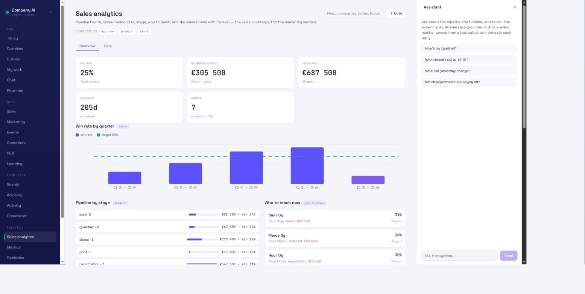
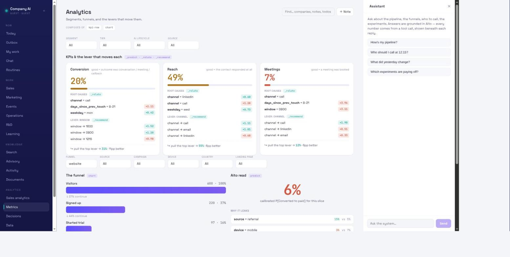
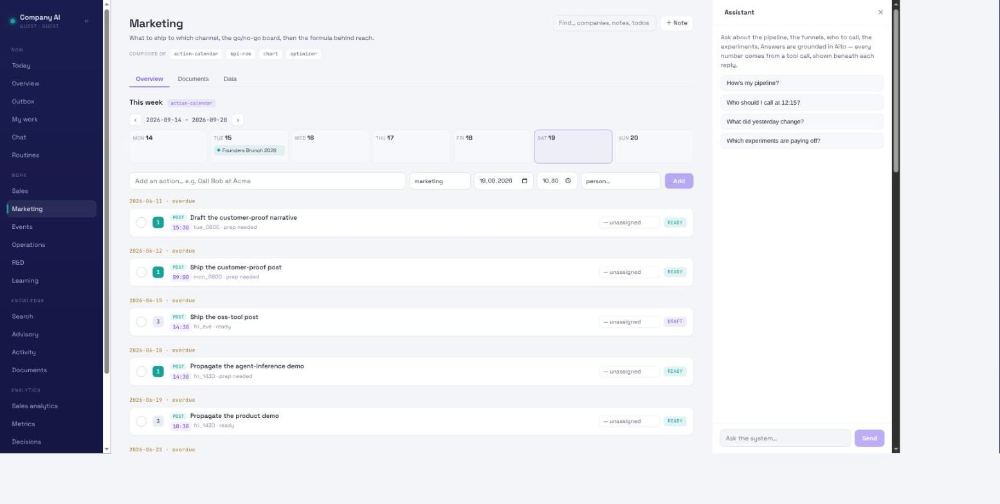

# aito-company-ai

A one-person company's sales agent whose intuition is a predictive
database. Claude reasons; [Aito](https://aito.ai) ranks, retrieves, and
attaches calibrated probabilities; this repo is the thin plumbing between
them. Every morning it answers three questions: who to call in today's
window and why, what the opener is, and what yesterday's outcomes changed.
It learns from every logged outcome.

The operational pattern behind [agent.aito.ai](https://agent.aito.ai),
run on our own pipeline. The morning brief is three MCP calls and a prompt.

```
Claude session (Code or Desktop)     reasoning: composes the brief,
        |                            drafts openers, takes log commands
        |  MCP (stdio)
        v
aito-company-ai MCP server           thin tool layer, zero logic
        |  HTTP
        v
Aito instance (docker)               intuition: ranking, similarity,
        ^                            calibrated confidence, learning
        |
   loaders (CLI)                     rolodex + outcome log -> Aito tables
```

## Setup (shared)

One Aito instance is the brain; both sides below read the same tables.

```sh
docker run -d -p 9005:9005 ghcr.io/aitohq/aito        # 1. an Aito instance
cp .env.example .env                                   # 2. point at it
uv run company-ai create-schema                        # 3. tables
uv run company-ai load-rolodex --seed                  # 4. synthetic seed data
uv run company-ai load-touches --seed                  #    (omit --seed for the real set)
uv run company-ai load-sessions --seed                 #    website funnel data
uv run company-ai load-posts --seed                    #    distribution post log
uv run company-ai load-todos --seed                    #    the action source
uv run company-ai load-deals --seed                    #    the sales pipeline
```

Then pick a side — most days you use both. Full guide:
[`docs/08-two-sides.md`](docs/08-two-sides.md).

## Side 1 — the agent (Claude over MCP)

For running the call window: who to call now, the opener, what changed,
and logging each result in a sentence.

```sh
claude mcp add aito-company-ai -- uv --directory "$PWD" run company-ai-mcp
```

To target a specific instance, pass its env file:
`-e COMPANY_AI_ENV=.env.aito`. For all your projects, add `-s user`. On a
**nix** host, if the server fails to start (`cannot import name 'Sentinel'`),
a leaked py3.11 `PYTHONPATH` is the cause — prefix the command with
`env -u PYTHONPATH`:
`claude mcp add aito-company-ai -- env -u PYTHONPATH uv --directory "$PWD" run company-ai-mcp`.

Restart the session, then ask for the morning brief using
`prompts/morning-brief.md`. The agent has tools for the brief
(`who_to_call`, `opener_context`, `what_changed`), the analytics
(`segment_360`, `funnel`, `score_post`, `deal_pipeline`, `todos_now`),
writing (`log_touch`, `log_decision`, `log_deal_update`, `complete_todo`),
and ingest (`add_contact`, `add_deal`), plus a `populate` prompt. Log a
result by sentence, or:

```sh
uv run company-ai log <contact_id> call 0800 no_answer
uv run company-ai brief --no-llm     # the brief without a model in the loop
```

## Side 2 — the human (the dashboard app)

A React app over a FastAPI backend — the same `/api/*` contract the agent
reaches via MCP, rendered for a human. Read-only: every number is an Aito
query.

The `./do` script manages it (run `./do help` for all commands):

```sh
./do install            # uv sync + npm install (one-time)
./do seed               # create schema + load every table from data/seed
./do start              # build + serve in the background → http://localhost:8770
./do status             # is it up? which instance, which build
./do restart            # rebuild + restart    ./do stop    ./do logs
./do dev                # vite hot-reload (:5173) + backend (:8770), for UI work
```

`./do` targets the Aito instance in `COMPANY_AI_ENV` (defaulting to
`.env.local` when present, so `./do seed` never drops tables on a real
instance by accident). Under the hood it's `uv run company-ai dashboard`
serving the built `frontend/` bundle.

The shell follows a fixed information architecture — **Now · Work (Sales,
Marketing, Operations, R&D) · Knowledge · Analytics** — and every view is
composed from shared primitives (`kpi-row`, `chart`, `optimizer`,
`action-pipeline`, `action-calendar`). It opens on **Now**: the most urgent
actions across every area, action-first.


Each Work view opens with its action block (Sales/Marketing by date,
Operations/R&D by priority), then its analytics. Spec:
[`docs/12-todos-and-now.md`](docs/12-todos-and-now.md). **Sales** also shows
the pipeline: each open deal's weighted value with Aito's calibrated
close-likelihood next to the operator's own probability — where they diverge
is the deal to look at ([`docs/13-deals.md`](docs/13-deals.md)).



The **Documents** view is the knowledge store the agent grounds on — the
operator's strategy, plans, and notes as a first-class Aito collection, tagged
by kind and area, linked to companies and people, edited in place, and searchable
([`docs/25-documents.md`](docs/25-documents.md)). Import an existing markdown
dir once with `company-ai documents-import <dir>`.

**Analytics — Segment 360.** Pick a slice (segment · tier · ai_lifecycle ·
source); each KPI shows the rate, the root causes (`_relate`), and the lever
(`_recommend`). Design in [`docs/07-dashboard.md`](docs/07-dashboard.md).



**Marketing** combines the website/acquisition funnel (visitor → signup →
trial → paid, with the biggest-drop leak and Aito's calibrated outlook) and
the **post scorer** — the messaging formula that predicts a draft's win
probability on its channel (LinkedIn reach / HN views, never upvotes) and the
lever to switch.



Specs: [`docs/09-funnels.md`](docs/09-funnels.md),
[`docs/10-messaging-formula.md`](docs/10-messaging-formula.md). The dashboard
architecture is in [`docs/11-dashboard-app.md`](docs/11-dashboard-app.md).
(Screenshots are synthetic seed data — no real contacts.)

## Privacy split

The repo tracks code and **synthetic** seed data only (generated by
`scripts/generate_seed.py`, fictional namespace, no phone numbers or email
addresses anywhere — only `phone_present`/`email_present` booleans). The
real rolodex lives outside the tree at `COMPANY_AI_DATA_DIR`; loaders read
it at runtime. Details in `docs/06-privacy.md`.

## Permissions

The agent is internal-facing: it reads the pipeline and drafts text for a
human to act on. It sends nothing outbound — no email, no LinkedIn, no
calendar writes; those are gated decisions, not features (see
`docs/05-phases.md`). Outcome logging is the only write, and it is always
operator-initiated.

## Tests

```sh
uv run booktest book          # review-driven snapshots, see docs/04-testing.md
```
