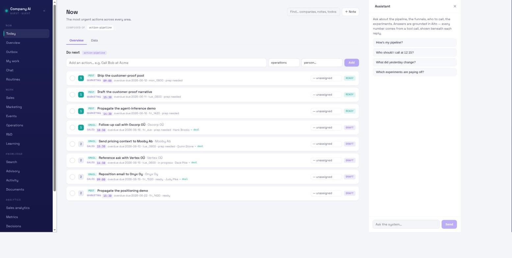

# Todos and the action-first Now view

Rev 3 of the architecture spec makes **action-first** the organizing law:
every work view opens with what to do next, and *Now* is the landing view —
the most urgent actions across every area. This is the data and logic behind
that.

## One table, three lenses

The `todos` table (schema in `docs/02-schema.md`, §2.9 of the architecture
spec) is the single action source. Three lenses read it (`todos.py`):

| Lens | Scope | Order | Used by |
|---|---|---|---|
| `now` | all areas, open | overdue → priority → due-date proximity | the Now view |
| `pipeline` | one area, open | priority (1 = highest) | Operations, R&D |
| `calendar` | one area, open, dated | by due_date | Sales, Distribution |

A todo carries both a `priority` and an optional `due_date` + `window`, so
the same row serves both lenses. The split is an invariant the loader
enforces: **calendar areas (sales, distribution) must have a due_date;
pipeline areas (operations, R&D) must not** — a dated Operations todo or an
undated Sales todo is a bug, not a quiet default. `linked_id`/`linked_type`
tie a todo to a contact or asset, so the action surface joins back to the
rolodex (a sales todo shows its company).

## Why this is deterministic, not inference

Ordering a worklist by priority and due-date proximity is **formatting**,
not prediction, so it lives in Python — CLAUDE.md rule 2 governs *predictive*
logic (similarity, weighting, pattern-matching), which this is not. The
urgency key is rule-based and explainable: overdue work first, then by
priority, then by how soon it's due.

**The Aito layer is the next increment, and it's the dogfood payoff.** Once
done/slipped history accrues on todos, `_predict` of slip-risk per todo —
given area, priority, prep_status, days-until-due — would *re-rank* the Now
view by "what's most likely to slip," and `decisions` already records
agent-recommended-vs-done. Until that history exists, the ranking is honest
and rule-based, and the Now view says so by simply ordering, not predicting.

## The surfaces

- **Dashboard:** the Now view (action-pipeline) is the landing page; Sales
  and Distribution open with the calendar lens, Operations and R&D with the
  pipeline lens, each followed by their analytics.
- **Agent (MCP):** `todos_now` and `todos_area` return the same lenses, so a
  Claude session gets the action surface in chat — the Now view *is* the
  action core of the morning brief.

```sh
uv run company-ai load-todos --seed
uv run company-ai dashboard            # http://localhost:8770/#/now
```



## The closed loop: completing a deal-linked todo advances its deal

Sales todos carry `linked_type=deal` — the action advances a specific
opportunity. Completing one is a single step, `complete_todo` (CLI:
`company-ai complete <todo_id> [--deal-stage ..] [--deal-probability ..]`;
MCP: `complete_todo`): it marks the todo done (so it drops from every lens)
and, when deal changes are supplied, calls `log_deal_update` to advance the
linked deal — the pipeline re-ranks and the risk model re-derives at once.
So "I called Kassapaja and moved it to negotiation" is one action that both
clears the todo and updates the pipeline. The round-trip is booktested
(`book/test_todos.py`); omitting the deal args just closes the todo.

Completion is operator/agent-initiated, through the dashboard, the CLI, or
the `complete_todo` MCP tool.

## Done vs. archived: two terminal states

Not every action gets finished — some get abandoned. `archive_todo` (CLI:
`company-ai archive <todo_id>`; MCP: `archive_todo`; dashboard: the Archive
button and swipe-left) is the counterpart to completion: it sets the todo to
a second terminal status, `archived`, so it drops from every lens exactly as
`done` does — but, unlike completion, it advances nothing (no deal move, no
outcome logged). `schema.TERMINAL_STATUSES = {done, archived}` is the single
definition both the lenses and the open-todo invariants read, so a terminal
todo is uniformly off the worklist and exempt from the calendar/pipeline
due-date rule. Archiving is reversible: re-open a todo by editing its status
back. The round-trip (archive drops it from the lens, leaves the deal
untouched) is booktested.

## One action table, rich metadata, area → view

There is a single `todos` table; a todo's `area` routes it to its view —
Sales, Distribution, Operations, R&D, or Experiments. **Operations is the
catch-all** for work that doesn't belong to a named area (a quick-add from the
Now view lands there). Beyond area, a todo carries:

- `action_type` — what you physically do (call, email, meeting, message,
  research, admin, post, ship), independent of area;
- a `stakeholder_id` — the **contact** the action concerns (the person), and
  `linked_id`/`linked_type=deal` — the opportunity it advances. `company` is
  *derived* for display from either link, never stored (one source of truth).
- a `slot` — an HH:MM clock time for dated todos (sales calls, marketing
  posts, ops deadlines happen at a specific time), shown in the calendar.

Due-date rules by area: **sales** and **marketing** (calendar areas) *require*
a due_date; **operations** (a deadline area) allows one *optionally* — ops
work often has deadlines (renewals, reports) but plenty is just ongoing, so a
dated ops todo shows on a week calendar while undated ops work stays in the
priority pipeline; **rnd** and **experiments** *forbid* a due_date (pure
priority pipelines). The week grid leads the calendar lens, and appears in the
Operations pipeline once any item has a deadline.

So "Call Globex / Mika" is a sales todo, action_type=call, stakeholder →
Mika (a contact at Globex), linked to the Globex deal — and it shows under
Sales with the company joined in.

## Editing in the dashboard (the one write surface)

Todos are editable in the UI. Each view leads with an **embedded quick-add
bar**: type an action, press Enter, done — only a couple of fields show
(type/area and a person), and Aito fills the rest as you pause typing (below).
Clicking any existing row opens the **full editor** for the remaining fields,
or to mark it done. Backed by `POST /api/todos`, `PATCH /api/todos/{id}`, and
`POST /api/todos/{id}/complete` (and the `add_todo`/`update_todo`/
`complete_todo` MCP tools for the agent). This is the dashboard's only write
surface — operator CRUD on its own worklist, not reasoning, so it stays
within rule 1's read-only-presentation spirit. Every field is validated
server-side (`log.add_todo`/`update_todo`): an unknown enum, a dangling deal/
stakeholder link, or a calendar/pipeline due-date violation raises, never
coerces (rule 3).

## Auto-assign: Aito fills the blanks (Pass 2)

As you type a title (in the quick-add bar, or the full editor's Suggest
button), Aito fills the blank classifying fields **~half a second after you
stop typing**: `area` and `action_type` are an Aito `_predict` from the
title's words (the title is an analyzed Text column), returned with their
calibrated $p; and a literal scan offers a stakeholder when a known contact's
name or company token appears in the title. The suggestions populate the
visible fields but are **never auto-saved** — you press Enter to confirm, and
can override any field first (the chosen suggest-then-confirm UX). Honest cold start: distinctive titles classify
confidently (distribution/operations/rnd ≈ 0.8–0.95 on the seed), thin areas
stay weak (experiments ≈ 0.5) — shown as-is. `classify_todo` is also an MCP
tool, so the agent fills the same blanks the same way. Prediction stays
Aito's (rule 2); the stakeholder scan is a labelled literal lookup, not a
ranking. See `src/company_ai/classify.py`.

Todos seed is synthetic (no PII); real todos load from the private path like
the rest. The Knowledge Documents store is `docs/25`.

## Work routing: `role` and `owner` (agent lanes)

Once more than one Claude agent works the backlog, a todo needs to say *whose*
it is. Two columns carry that, and they answer different questions:

- **`role`** — WHICH LANE the work belongs to: a repo slug (`aito-core`,
  `aito-demo`), a surface, or `operator` for the human's own items. An agent
  filters its queue on this. Deliberately a slug rather than an enum, validated
  for shape only (`schema.SLUG_PATTERN`): which lanes exist is
  deployment-specific, unlike `area`, which is architectural.
- **`owner`** — WHICH AGENT INSTANCE inside that lane (`core-a`, `core-b`), for
  a role run by several agents at once. null means the lane's shared queue.

Both are ordinary editable fields, set by whoever files the todo — via the
`add_todo`/`update_todo` MCP tools, the CLI, or the dashboard's action editor,
which exposes an **agent lane** + **owner** picker (suggesting the lanes already
in use) and shows the lane as a `⚙ lane · owner` chip on each row. That editor is
why routing a task to an agent no longer means writing the agent's name into the
title.

### Self-service claim: `claim_todo` (best-effort), and why it isn't a hard CAS

An agent claims the next unclaimed todo in its role before working it, so two
agents don't pick the same one — the MCP tool `claim_todo(todo_id, agent)` sets
`owner` and **raises `ClaimTaken` if another agent already holds it**. This became
viable once `update_entries` gained read-your-writes (it `optimize`s after the
`_modify` update); before that the read-back arbiter was unsound under staleness.

It is **best-effort, not a hardware compare-and-set** (Aito exposes none):

1. A **read-check** rejects a todo already owned by another agent — no stealing.
   This covers the common case (an item someone claimed a while ago).
2. Then a single-field `update_entries` sets `owner` and flushes, and a
   **read-back** reports the holder. `_modify`'s `where` can't express "only if
   still unclaimed" (`null` predicates 400), so the guard is the read-check +
   read-back, not a conditional write.

The residual race is the ~millisecond window between one claimant's read-check
and its write commit: two agents that both read the same *free* todo as unclaimed
in that window can both proceed (each can read back its own id before the other
overwrites). It is rare — agents pull different top items — and the `review` gate
below plus a human close catch a double-worked ticket. **The honest mechanism for
two agents on one lane is still to give them disjoint work** (distinct `owner`, or
one agent per role) when correctness must be guaranteed; `claim_todo` removes the
polling for the ordinary case. A hard guarantee needs an engine-level atomic CAS /
rows-affected on `_modify` — tracked on the Aito wishlist.

### The `review` status

An agent that finishes sets `status='review'`, not `done`. Review is *not*
terminal: the todo stays on the worklist until a person closes it with
`complete_todo`. Agent work does not self-certify.
