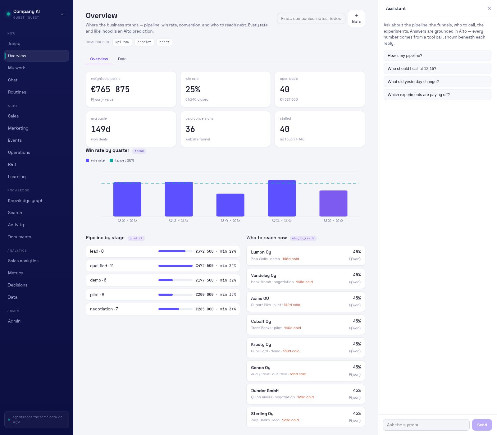
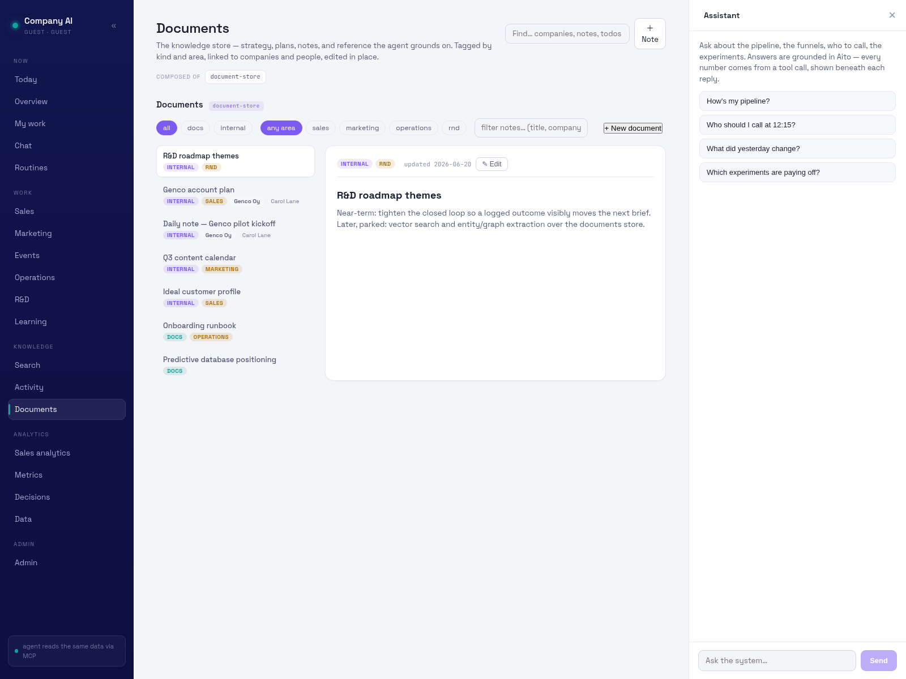
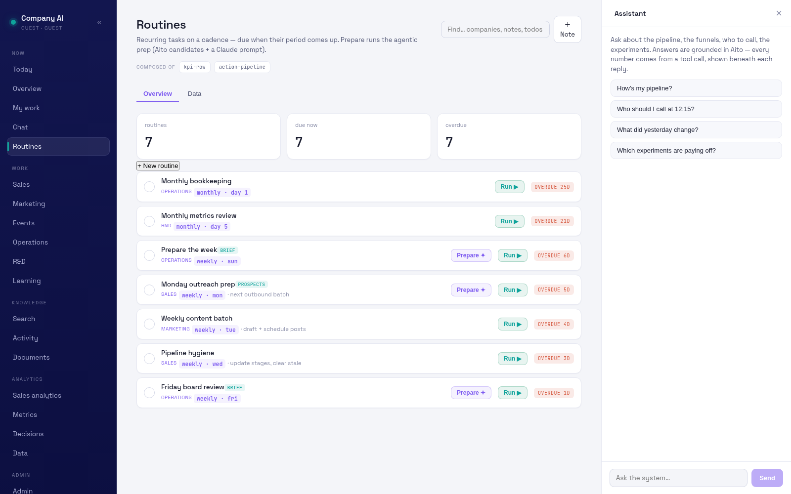
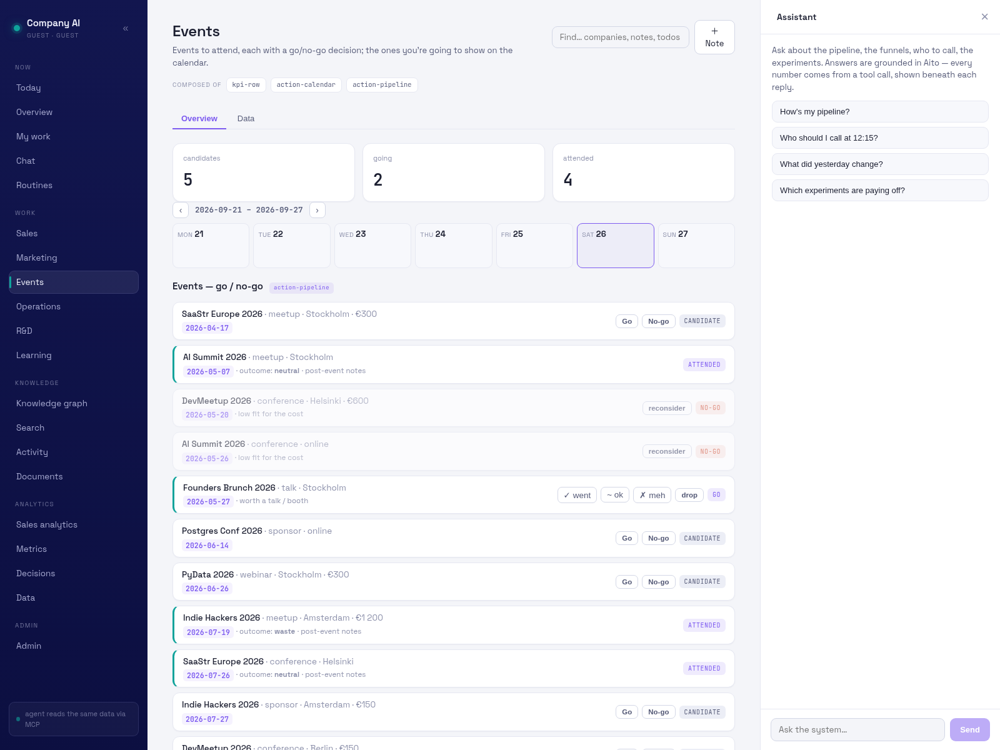
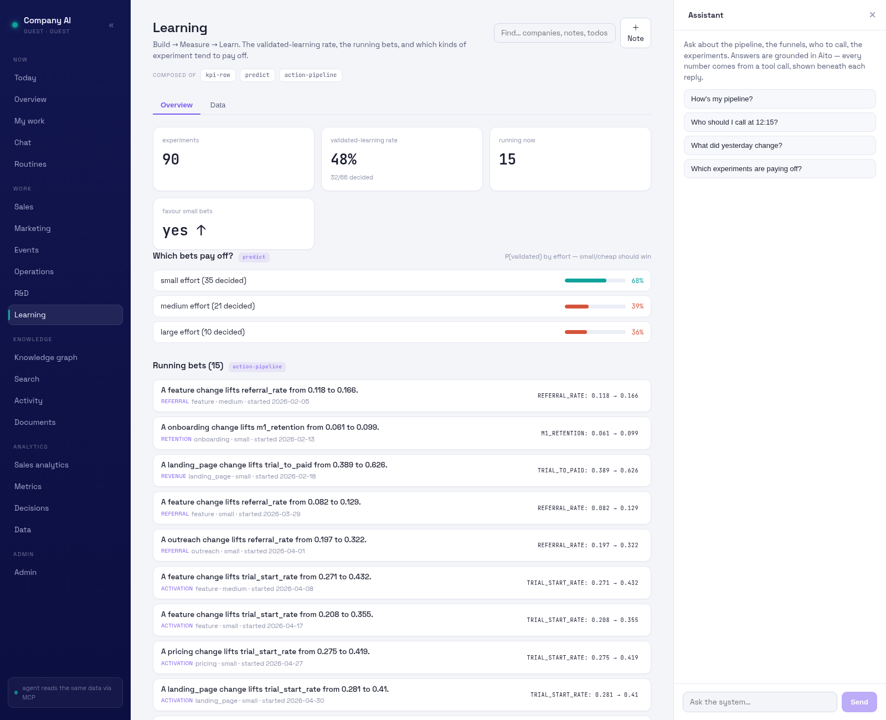

# The tour

What this actually does, one screen at a time.

Company AI runs a one-person company's sales and marketing: what to do today,
which deals will close, where the funnel leaks, what to post, what to read
before a call. The thing that makes it different from a CRM is that **every
rate, ranking and likelihood on these screens is a prediction from the
company's own history** — not a rule someone wrote, not a weight someone
tuned. When the history changes, the numbers change by themselves.

You don't need to know how that works to read this tour. The last two
chapters are there if you want to change it.

> Every screenshot is the public demo — synthetic companies, synthetic
> people, synthetic deals, all of it in [`data/seed`](../../data/seed). No
> real contacts appear anywhere in this repository.

Run the same thing locally in about a minute:

```sh
./do install && ./do seed && ./do start     # → http://localhost:8770
```

---

## The loop, in two screens

Two questions, asked constantly, in a loop: **what should I do right now**,
and **where does the business actually stand**. Everything else in the tour
hangs off one of those.

| What to do now | Where it stands |
|---|---|
|  |  |

---

## 1 · "What should I do right now?"


*Today — the most urgent actions across every area, newest problems first.*

The landing screen is a to-do list that sorts itself. Sales and marketing work
is time-driven, so it arrives by date; operations and R&D are priority-driven,
so they arrive ranked. You are not asked to choose a view before you can see
what is late.

The point is that nothing here is a static list: a deal going cold, an
experiment coming due, or a todo aging past its window changes what floats to
the top, without anyone re-prioritising by hand.

## 2 · "Where does the business stand?"


*Overview — weighted pipeline, win rate against target, and who to reach next.*

Six numbers for the state of the company: weighted pipeline, win rate, open
deals, average cycle length, paid conversions, and how much has gone stale.
Weighted means each deal is multiplied by its *predicted* probability of
closing, so the pipeline figure is not the optimistic sum of everything open.

Below them, the win rate by quarter against the target line, the pipeline
broken out by stage with the predicted win rate for each, and **who to reach
now** — open opportunities ranked by how likely they are to close, with how
long each has been cold. That ranking is the shortlist for the day.

## 3 · "Which of these deals will actually close?"


*Sales analytics — the pipeline, the win-rate trend, and each deal's
predicted close likelihood.*

Every open deal carries two probabilities: the operator's own gut number, and
Aito's, computed from what happened to similar deals before. **Where the two
diverge is the interesting part** — a deal you are confident about that the
history says is weak, or the reverse, is the one to look at this week.

The prediction conditions on the things you know *before* the outcome — stage,
what is blocking it, whether there is a champion — so it is honest about deals
it has seen few of. Early on, with little history, the probabilities are weak
and roughly evenly spread. That is the system working correctly, not a bug:
a confident number from four data points would be the defect.

## 4 · "Where is the funnel leaking, and what should I post?"


*Marketing — the acquisition funnel with its biggest drop, and the post scorer.*

The funnel runs visitor → signup → trial → paid, and rather than just drawing
the bars it names **the biggest drop** — the single stage costing the most —
and what most moves it.

The post scorer is the other half: paste a draft and it predicts how it will
do on its channel before you publish, along with the lever most likely to
improve it. It predicts reach — LinkedIn impressions, HN views — deliberately
never upvotes, because upvotes are the thing you cannot honestly optimise for.

## 5 · "Why is this segment underperforming?"


*Segment 360 — pick a slice, and every KPI explains itself.*

Pick a slice of the business — segment, tier, lifecycle stage, acquisition
source — and each KPI shows three things: the rate, **the root causes** behind
it, and **the lever** that moves it. The causes are not a correlation table
someone assembled; they are the conditions the data itself says travel with
the outcome, ranked by how strongly.

This is the screen for the question "our ERP segment converts badly — why?"
where the useful answer is a ranked list of what is actually different about
those accounts.

## 6 · "What do we already know about this account?"



*Documents — strategy, plans and call notes as first-class linked records.*

Notes, plans, playbooks and strategy live in the same store as the pipeline,
tagged by kind and area, and linked to the companies and people they concern.
So a note taken after a call hangs off the same account node as its contacts,
deals and touches, and turns up when you open that account — rather than
sitting in a folder someone has to remember.

It doubles as what the assistant reads. **Search** ranks across documents,
contacts and deals together by relevance, and it learns: results that get
clicked for a given query rise for similar queries later, so the ranking
sharpens with use instead of staying frozen.

## 7 · "What do I do every week?"



*Routines — recurring work on a cadence, with the prep already done.*

Recurring work — Monday outreach prep, weekly content batch, pipeline hygiene,
the monthly books — becomes due when its period comes round. **Prepare** is
the part worth looking at: it assembles the candidates from the data and hands
over a filled-in prompt, so the weekly task starts from a ranked shortlist
rather than a blank page.

## 8 · "Is this event worth going to?"



*Events — a go/no-go board rather than a calendar.*

Conferences and meetups as a decision queue: what is coming, what it costs,
and a go or skip recorded against it — so the question gets answered
deliberately once, and the answer is still there next year when the same
event comes round.

## 9 · "Did that experiment pay off?"



*Learning — experiments with their outcomes attached.*

The build–measure–learn loop, written down: what was tried, what was expected,
what happened. It closes the loop the rest of the tour depends on — a logged
outcome is exactly what changes tomorrow's predictions, so recording a result
is not bookkeeping, it is how the system gets better at its job.

---

## How it works: the Aito calls

This is the only chapter with query bodies in it. Four calls carry
essentially the whole product, all against
[Aito](https://aito.ai), a predictive database — you send rows once and
query for predictions, with no model to train, deploy or retrain.

**`_predict` — how likely is this outcome?** Drives close likelihood,
who-to-reach, and the post scorer:

```json
{
  "from": "deals",
  "where": { "stage": "negotiation", "blocker": "budget", "champion_present": "yes" },
  "predict": "won",
  "select": ["$p", "$value", "$why"]
}
```

`$p` is the calibrated probability; `$why` is the breakdown of which features
pushed it up or down, which is what lets the UI explain a number instead of
merely printing it.

**`_relate` — what travels with this outcome?** Drives the root causes in
Segment 360 and the funnel:

```json
{
  "from": "touches",
  "relate": { "$on": [{ "reached_deepest": true }, { "segment": "erp" }] },
  "limit": 150
}
```

**`_recommend` — which choice would move it?** Drives the lever:

```json
{
  "from": "sessions",
  "where": { "segment": "erp" },
  "recommend": "source",
  "goal": { "reached_deepest": true },
  "limit": 8
}
```

**`$match` + `orderBy` — smart search.** The query is tokenised and OR'd so an
item matches on any term, then Aito ranks the matches by probability of
relevance; clicks feed back in so the ranking improves with use.

The rule the codebase holds itself to is that **ranking, scoring and
similarity are always the database's job** — there is no scoring heuristic in
the application code to drift out of sync with the data. Full detail in
[`docs/13-deals.md`](../13-deals.md), [`docs/09-funnels.md`](../09-funnels.md)
and [`docs/23-search.md`](../23-search.md).

## Fork it

If you want to change the behaviour rather than just run it:

| You want to… | Start here |
|---|---|
| Understand the whole design | [`docs/01-architecture.md`](../01-architecture.md) |
| Add a table, view or routine | [`docs/19-extending.md`](../19-extending.md) |
| Change what the schema holds | [`docs/02-schema.md`](../02-schema.md) |
| Change a prediction | the spec for that view — deals, funnels, search above |
| Know the rules contributors follow | [`CLAUDE.md`](../../CLAUDE.md) |
| Set it up to develop on | [`CONTRIBUTING.md`](../../CONTRIBUTING.md) |

Two constraints are worth knowing before you fork, because they explain most
of the design. **Predictive logic lives in queries, not in Python** — if you
find yourself writing a scoring heuristic, it belongs in a query instead. And
**unexpected data raises rather than gets skipped**: a missing field or an
unknown enum value stops the run with the offending row attached, on the view
that the surprise is information worth seeing.
