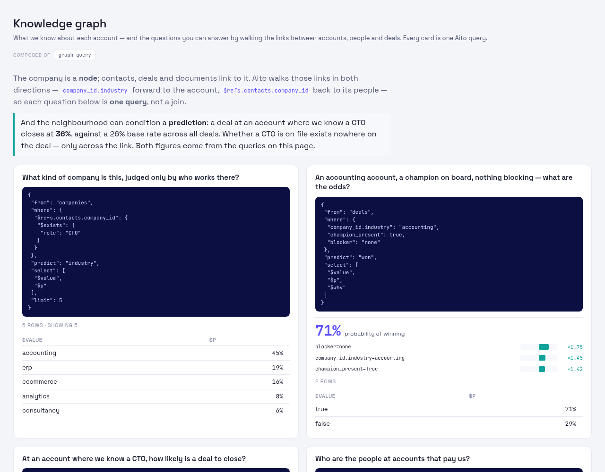
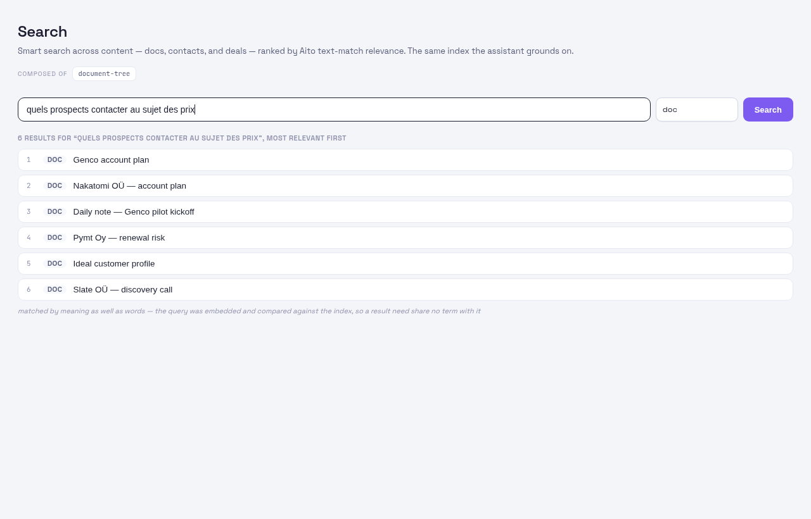

# The tour

What this actually does, one screen at a time.

Company AI runs a small company end to end: what to do today, what is in the
pipeline and what has gone quiet, where the funnel leaks, what to post, which
experiments paid off, what was decided and why — and the notes and accounts
underneath all of it. The
thing that makes it different from a CRM is that **every
rate, ranking and likelihood on these screens is a prediction from the
company's own history** — not a rule someone wrote, not a weight someone
tuned. When the history changes, the numbers change by themselves.

You don't need to know how that works to read this tour. The last two
chapters are there if you want to change it.

One thing the screenshots cannot show: **these screens are the operator's half
of it.** The agent lanes that work this data daily never open the dashboard —
they go through MCP from a Claude session, calling the same functions these
views render. So read each screen as a question with two front doors, one you
look at and one you ask.

> Every screenshot is the public demo — synthetic companies, synthetic
> people, synthetic deals, all of it in [`data/seed`](../../data/seed). No
> real contacts appear anywhere in this repository.

Run the same thing locally in about a minute:

```sh
./do install && ./do seed && ./do start     # → http://localhost:8770
```

---

## The loop, in two screens

Two questions, asked constantly, in a loop: **what should I do right now**,
and **where does the business actually stand**. Everything else in the tour
hangs off one of those.

| What to do now | Where it stands |
|---|---|
|  |  |

---

## 1 · "What should I do right now?"


*Today — the most urgent actions across every area, newest problems first.*

The landing screen is a to-do list that sorts itself. Sales and marketing work
is time-driven, so it arrives by date; operations and R&D are priority-driven,
so they arrive ranked. You are not asked to choose a view before you can see
what is late.

The point is that nothing here is a static list: a deal going cold, an
experiment coming due, or a todo aging past its window changes what floats to
the top, without anyone re-prioritising by hand.

**The honest limit:** sorting does not close anything. In real use the sales
area has carried months-old todos still marked ready, and nothing on this
screen forces the issue. As the CRO lane puts it, *"the board is only as
current as the agents that close tickets."*

## 2 · "Where does the business stand?"


*Overview — weighted pipeline, win rate against target, and who to reach next.*

Six numbers for the state of the company: weighted pipeline, win rate, open
deals, average cycle length, paid conversions, and how much has gone stale.
Weighted means each deal is multiplied by its *predicted* probability of
closing, so the pipeline figure is not the optimistic sum of everything open.

Below them, the win rate by quarter against the target line, the pipeline
broken out by stage with the predicted win rate for each, and **who to reach
now** — open opportunities ranked by how likely they are to close, with how
long each has been cold. That ranking is the shortlist for the day.

## 3 · "Which of these deals will actually close?"


*Sales analytics — the pipeline, the win-rate trend, and each deal's
predicted close likelihood.*

Every open deal carries two probabilities: the operator's own number, and one
computed from what happened to similar deals before.

**Be honest about the second one.** On a real pipeline of about twenty deals it
has not earned its keep — the CRO lane reports it as sparse-data noise (a
strong prior plus an over-lift for having a champion) and defers to the
operator's own probability. It is carried here as an experiment that gets
better as the closed history grows, not as a number to act on. The view it
earns its place by is the plain one: what is open, how big, and how long since
anyone touched it.

The prediction conditions on the things you know *before* the outcome — stage,
what is blocking it, whether there is a champion — so it is honest about deals
it has seen few of. Early on, with little history, the probabilities are weak
and roughly evenly spread. That is the system working correctly, not a bug:
a confident number from four data points would be the defect.

## 4 · "Where is the funnel leaking, and what should I post?"


*Marketing — the acquisition funnel with its biggest drop, and the post scorer.*

The funnel runs visitor → signup → trial → paid, and rather than just drawing
the bars it names **the biggest drop** — the single stage costing the most —
and what most moves it.

The post scorer is the other half: paste a draft and it predicts how it will
do on its channel before you publish, along with the lever most likely to
improve it. It predicts reach — LinkedIn impressions, HN views — deliberately
never upvotes, because upvotes are the thing you cannot honestly optimise for.

## 5 · "Why is this segment underperforming?"


*Segment 360 — pick a slice, and every KPI explains itself.*

Pick a slice of the business — segment, tier, lifecycle stage, acquisition
source — and each KPI shows three things: the rate, **the root causes** behind
it, and **the lever** that moves it. The causes are not a correlation table
someone assembled; they are the conditions the data itself says travel with
the outcome, ranked by how strongly.

This is the screen for the question "our ERP segment converts badly — why?"
where the useful answer is a ranked list of what is actually different about
those accounts.

## 6 · "What do we already know about this account?"


*Documents — strategy, plans and call notes as first-class linked records.*

Notes, plans, playbooks and strategy live in the same store as the pipeline,
tagged by kind and area, and linked to the companies and people they concern.
So a note taken after a call hangs off the same account node as its contacts,
deals and touches, and turns up when you open that account — rather than
sitting in a folder someone has to remember.

It doubles as what the assistant reads. **Search** ranks across documents,
contacts and deals together by relevance, and it learns: results that get
clicked for a given query rise for similar queries later, so the ranking
sharpens with use instead of staying frozen.

This chapter is the one that gets used most. Asked how the agent lanes actually
use the system, the CRO lane put this first:

> *"'Everything we have on `<person> <company>`' before a meeting: one semantic
> search, then `document_read` on the 2–4 hits. This is THE load-bearing use."*

It is worth being clear about what that means for the rest of the tour: the
predictive screens are the interesting part, but **recall across one linked
store is the part that earns its keep every day.** The same lane's second
most-asked question is of the same shape — *"what did we last say or promise to
this company, and what's still open?"* — search, then read.

## 7 · "What kind of company is this, judged by who works there?"

[](../31-knowledge-graph.md)

*The Knowledge graph — each question beside the single query that answered it.*

Accounts, people, deals and notes are linked, and those links can be walked in
both directions: forward from a deal to its account, and backwards from an
account to its people. That turns questions that would otherwise need a join
into one query — "who works at the accounts that pay us", "which accounts have
a CTO on file", "what is in play across an industry".

Two of the cards do something a relational database cannot. One infers an
account's **industry from the people linked to it**, never reading the
account's own industry at all. The other predicts whether a deal will be won
from a fact that exists nowhere on the deal — whether a CTO is on file at that
account — and returns **what each fact did to the number**, as a multiplier.
The answer arrives with its reasons rather than as a bare probability.

## 8 · "Where did we discuss pricing?" — asked in the wrong language



*A French query returning English documents, none sharing a word with it.*

Search ranks documents, contacts and deals together, and it learns: a result
clicked for one query rises for similar queries later. With embeddings
configured it also matches on **meaning**, so a question asked in Finnish or
French finds a note written in English — which matters when the notes are
written in whichever language the meeting happened in.

Without embeddings it degrades to plain text matching rather than breaking;
the semantic layer is additive, not required.

## 9 · "What do I do every week?"


*Routines — recurring work on a cadence, with the prep already done.*

Recurring work — Monday outreach prep, weekly content batch, pipeline hygiene,
the monthly books — becomes due when its period comes round. **Prepare** is
the part worth looking at: it assembles the candidates from the data and hands
over a filled-in prompt, so the weekly task starts from a ranked shortlist
rather than a blank page.

**In practice this one has not landed.** The lane that should be using it
reports the board *"has been decorative (every routine overdue)"* — because
routines are only ticked when someone remembers to tick them, and the prepared
prompt does not help if the cadence itself is fiction. The design holds; the
habit did not. It is written down here rather than quietly dropped.

## 10 · "Is this event worth going to?"


*Events — a go/no-go board rather than a calendar.*

Conferences and meetups as a decision queue: what is coming, what it costs,
and a go or skip recorded against it — so the question gets answered
deliberately once, and the answer is still there next year when the same
event comes round.

## 11 · "Did that experiment pay off?"


*Learning — experiments with their outcomes attached.*

The build–measure–learn loop, written down: what was tried, what was expected,
what happened. It closes the loop the rest of the tour depends on — a logged
outcome is exactly what changes tomorrow's predictions, so recording a result
is not bookkeeping, it is how the system gets better at its job.

---

## 12 · "What is R&D actually working on?" — the ticket as a lab notebook

The same todos table carries the product side, and it is used in a shape the
sales side never touches. R&D work arrives ranked by priority instead of laid
out by date, and a ticket is not a line item to be checked off — it is the
running record of the work:

> *"Mine is 'append this finding to the ticket that owns it' — the ticket as a
> running lab notebook. Reads are almost always a single todo by id, not
> search."*
> — the CPO lane

Appends are dated and additive, so a claim that turns out to be wrong is
**corrected in place by a later entry rather than edited away**. That is the
property that makes the history worth keeping:

> *"One ERP-accuracy regression ticket carried a week of history across four
> sessions — found by one lane, released in writing, picked up by a second,
> measured by a third, corrected by me — and any of us could reconstruct where
> it stood cold, including which earlier claims were retracted and why."*
> — the CPO lane

**The review gate.** Moving R&D work to `review` requires a handoff block —
`CLAIM`, `VERIFY`, `SCOPE`, `RISK`, `PUSHED` — and the requirement is checked,
not merely written down somewhere. Agent-completed work therefore cannot
self-certify as done; it waits for a human:

> *"The validator rejected a review I tried to set without it, and the forced
> CLAIM line twice exposed that the work wasn't finished."*
> — the CPO lane

**What the ticket is not.** The lane that *receives* this work draws the line
in a different place from the lane that files it. Asked whether a ticket is
enough to pick engineering work back up after losing context, a core dev lane
said it resumed from the git log and branch, committed design notes, its own
memory files and its peers' messages — and that *"the ticket wasn't read
once."* So the claim this chapter makes is the narrow one: a ticket carries
the brief, the claim and the handoff, which is what coordination needs. The
resumable state of the engineering itself is the commits, because that is what
a build and a review actually check.

**Where it falls short**, from the same notes, because this is the chapter most
at risk of sounding tidier than it is:

- A handoff block cannot tell a verification from a relayed claim. When one
  lane's MCP is down and another writes the handoff for it, `VERIFY` records
  what it was told, and the format looks identical.
- Tickets grow into logs — many thousands of words of appends, with no
  structured field for *current status* or *next step*, so the latest state is
  hard to find in the history that makes the ticket valuable.
- `owner` and `role` are free text, so one lane appears under several spellings.
  The same silent-drift class as a mismatched area name, and still open.
- The board is reachable only while MCP is. A core dev lane spent a whole
  working session unable to connect, and its work arrived as ticket ids pasted
  into peer messages, with another lane writing the board on its behalf. There
  is no fallback path to the store when the tool surface is down.
- There is no "what needs a decision from a human" view across tickets, and no
  structured *current status* field — so the R&D lanes keep a separate,
  human-facing decisions list outside the board. That is a missing feature
  rather than a preference: a board that answers "what is waiting on me across
  twenty lanes" in fifteen minutes would replace it.

## How it works: the Aito calls

This is the only chapter with query bodies in it. Four calls carry
essentially the whole product, all against
[Aito](https://aito.ai), a predictive database — you send rows once and
query for predictions, with no model to train, deploy or retrain.

**`_predict` — how likely is this outcome?** Drives close likelihood,
who-to-reach, and the post scorer:

```json
{
  "from": "deals",
  "where": { "stage": "negotiation", "blocker": "budget", "champion_present": "yes" },
  "predict": "won",
  "select": ["$p", "$value", "$why"]
}
```

`$p` is Aito's probability; `$why` is the breakdown of which features
pushed it up or down, which is what lets the UI explain a number instead of
merely printing it.

**`_relate` — what travels with this outcome?** Drives the root causes in
Segment 360 and the funnel:

```json
{
  "from": "touches",
  "relate": { "$on": [{ "reached_deepest": true }, { "segment": "erp" }] },
  "limit": 150
}
```

**`_recommend` — which choice would move it?** Drives the lever:

```json
{
  "from": "sessions",
  "where": { "segment": "erp" },
  "recommend": "source",
  "goal": { "reached_deepest": true },
  "limit": 8
}
```

**`$refs` — walk the link backwards.** Everything above reads *from* a row
towards what it points at. `$refs` goes the other way: on a company,
`$refs.contacts.company_id` is the set of contacts pointing at it, which is how
"which accounts have a CTO on file" is one query:

```json
{ "from": "companies",
  "where": { "$refs.contacts.company_id": { "$exists": { "role": "CTO" } } },
  "select": ["name", "industry", "relationship"] }
```

**`$match` + `orderBy` — smart search.** The query is tokenised and OR'd so an
item matches on any term, then Aito ranks the matches by probability of
relevance; clicks feed back in so the ranking improves with use.

The rule the codebase holds itself to is that **ranking, scoring and
similarity are always the database's job** — there is no scoring heuristic in
the application code to drift out of sync with the data. Full detail in
[`docs/13-deals.md`](../13-deals.md), [`docs/09-funnels.md`](../09-funnels.md)
and [`docs/23-search.md`](../23-search.md).

## Fork it

If you want to change the behaviour rather than just run it:

| You want to… | Start here |
|---|---|
| Understand the whole design | [`docs/01-architecture.md`](../01-architecture.md) |
| Add a table, view or routine | [`docs/19-extending.md`](../19-extending.md) |
| Change what the schema holds | [`docs/02-schema.md`](../02-schema.md) |
| Change a prediction | the spec for that view — deals, funnels, search above |
| Know the rules contributors follow | [`CLAUDE.md`](../../CLAUDE.md) |
| Set it up to develop on | [`CONTRIBUTING.md`](../../CONTRIBUTING.md) |

Two constraints are worth knowing before you fork, because they explain most
of the design. **Predictive logic lives in queries, not in Python** — if you
find yourself writing a scoring heuristic, it belongs in a query instead. And
**unexpected data raises rather than gets skipped**: a missing field or an
unknown enum value stops the run with the offending row attached, on the view
that the surprise is information worth seeing.
